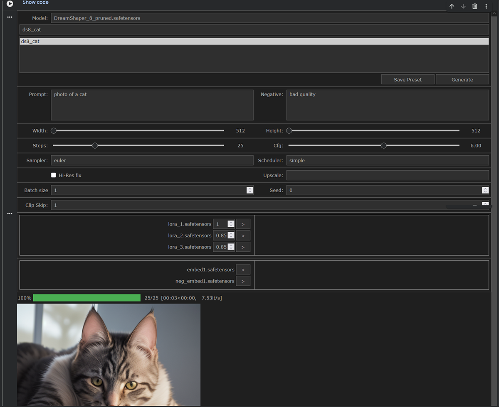

# FAGA (Fast AI Generation Architecture)
### A Programmatic Framework for ComfyUI Workflows

**FAGA** is a high-performance, object-oriented Python framework designed to orchestrate Generative AI workflows within Google Colab. Unlike standard node-based interactions, FAGA treats ComfyUI as a backend engine, providing a structured, typed, and scalable environment for image generation.



## 🚀 The Vision
Coming from a background in C# and Enterprise Architecture, I developed FAGA to solve the "spaghetti code" problem prevalent in many AI notebooks. The goal was to build a system that follows strict **SOLID principles**, provides a **reactive UI**, and manages complex hardware logistics (VRAM/Disk) automatically.

## 🛠 Key Features

- **Programmatic Workflow Engine:** Direct orchestration of ComfyUI nodes via Python, bypassing the web GUI for higher performance and custom logic.
- **Reactive UI:** A custom-styled, dark-mode interface built with `ipywidgets` and CSS, featuring dynamic layout scaling and event-driven updates.
- **Smart Logistics & Download Manager:** 
    - Accelerated multi-threaded downloads via `aria2c`.
    - Intelligent Google Drive integration using symbolic links to save space and time.
    - Automatic resumption of interrupted downloads.
- **Factory-Driven Architecture:** Uses the **Factory Pattern** to handle model-specific parameters (SD1.5, Flux, GGUF, etc.) through strongly-typed Dataclasses.
- **Persistence Layer:** A robust JSON-based preset system that allows users to save, name, and version-control generation parameters.
- **Memory Optimization:** Precise VRAM management through explicit tensor deallocation and CUDA cache clearing, enabling high-resolution passes (Hi-Res Fix) on limited hardware.

## 🏗 Software Architecture

The project is structured to demonstrate professional software design patterns:

- **Repository Pattern (`FileManager`):** Centralized management of model inventories, LoRAs, Embeddings, and User Presets.
- **Controller Pattern (`Workflow`):** Decouples the UI from the execution logic, orchestrating the download of dependencies before invoking the AI pipeline.
- **Data Transfer Objects (DTOs):** Extensive use of Python `dataclasses` with strict type hinting (`Pylance` Standard) to ensure data integrity across the pipeline.
- **Async-Style Event Handling:** Custom semaphores in UI setters to prevent circular event loops during reactive updates.

## 💻 Technical Stack

- **Language:** Python 3.10+
- **AI Engine:** ComfyUI (Programmatic API)
- **Deep Learning:** PyTorch
- **UI Framework:** Ipywidgets / IPython
- **System:** Linux / Google Colab (with cross-platform Windows dev awareness)
- **Tools:** `aria2c` for high-speed networking, `Git` for version control.

## 📁 Project Structure

```text
faga/
├── ai/
│   ├── factory.py          # ModelParamsFactory (Polymorphism handler)
│   ├── file_manager.py     # Inventory & Preset Repository
│   ├── download_manager.py # Aria2c & GDrive Logistics
│   ├── model_params.py     # Base Dataclasses
│   ├── workflow.py         # Main Orchestrator
│   └── workflows/          # Specialized AI Pipelines (SD15, etc.)
├── ui/
│   ├── prompt_form.py      # Main Reactive UI Controller
│   ├── custom_combo.py     # Hybrid Text/Dropdown Component
│   └── selectors/          # LoRA & Embedding logic
└── notebook.ipynb          # The "Single-Cell App" entry point
```

## 📈 Performance & Scalability
By avoiding the overhead of the standard ComfyUI frontend and optimizing the PyTorch environment (avoiding redundant reinstalls), FAGA achieves high iteration speeds (e.g., ~7.53 it/s on an SD1.5 base model in Colab T4).

## 🧑‍💻 About the Author
I am a veteran Software Engineer with 40 years of experience across the C#, C++, and Java ecosystems. This project represents my transition into Python and AI Engineering, applying decades of architectural experience to the modern Generative AI landscape.
